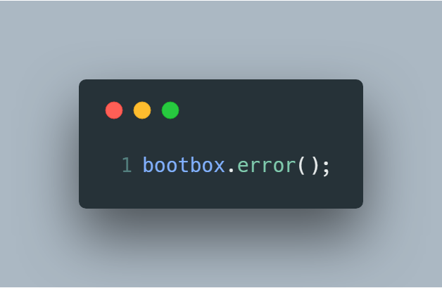
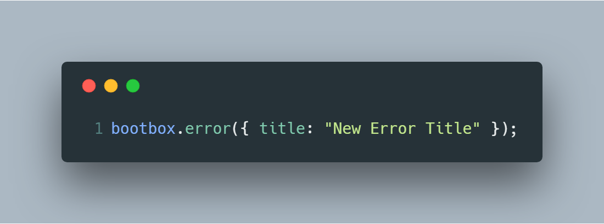
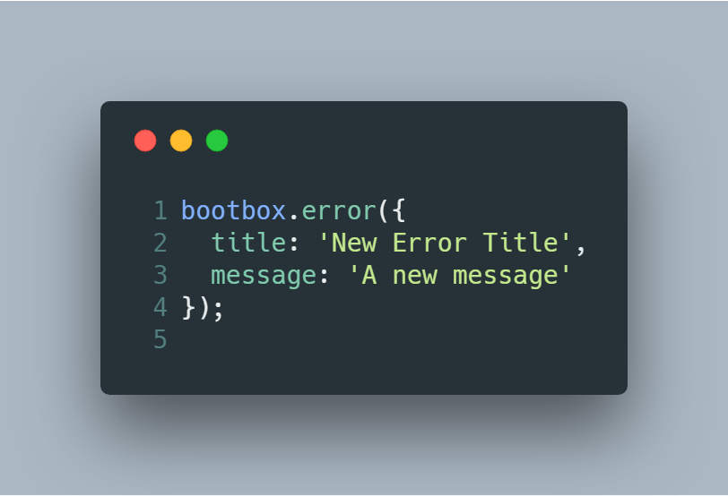
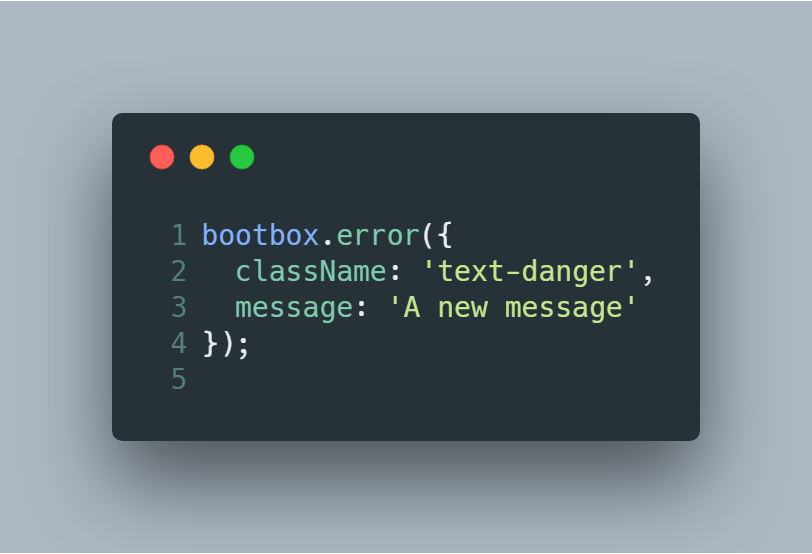
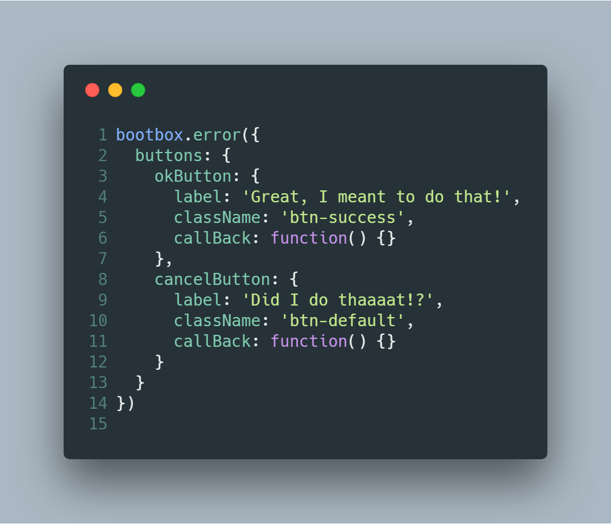

# BootboxJS Error Dialog
Bootbox Error extends BootBoxJS by adding in an error dialog. Include bootboxError.js after the files listed in the ***Requirements*** section

## Requirements
- jQuery (https://github.com/jquery/jquery)
- Twitter Bootstrap (https://github.com/twbs/bootstrap)
- BootboxJS (https://github.com/makeusabrew/bootbox)

## Examples

### Use the defaults

### Change the title

### Change the title and the message

### Change the wrapper class and the message

### Change the buttons

